# UPC
# INGENIERÍA DE SOFTWARE
## CURSO: SI730 Aplicaciones Web | SECCIÓN WX56 
 Profesor: Alex Humberto Sánchez Ponce
# Informe de Trabajo Final

"MealMaster"
### Integrantes:
- Cortés Casas, Joaquin Marcelo U202114545
- Diaz Silva, Fernando Josué U202112722
- Chávez Rojas, Carlos Raúl Guillermo U201910317
- Ruiz Blas, Luciano U20211F978
- Becerra Llempen, Fabiola U20171A518

---

Abril, 2024-1

# Contenido


[Registro de Versiones del Informe](#registro-de-versiones-del-informe)

[Project Report Collaboration Insights](#project-report-collaboration-insights)

[Student Outcome](#student-outcome)

[Capítulo I: Introducción](#capítulo-i-introducción)

[1.1 Startup Profile](#11-startup-profile)  
[1.1.1. Descripción de la Startup](#111-descripción-de-la-startup) 

[1.1.2. Perfiles de integrantes del equipo](#112-perfiles-de-integrantes-del-equipo)  

[1.2. Solution Profile](#12-solution-profile)  
[1.2.1 Antecedentes y problemática](#121-antecedentes-y-problemática)  
[1.2.2 Lean UX Process.](#122-lean-ux-process)  
[1.2.2.1. Lean UX Problem Statements.](#1221-lean-ux-problem-statements)  
[1.2.2.2. Lean UX Assumptions.](#1222-lean-ux-assumptions)  
[1.2.2.3. Lean UX Hypothesis Statements.](#1223-lean-ux-hypothesis-statements)  
[1.2.2.4. Lean UX Canvas.](#1224-lean-ux-canvas)  

[1.3. Segmentos objetivo.](#13-segmentos-objetivo)  

[Capítulo II: Requirements Elicitation & Analysi](#capítulo-ii-requirements-elicitation--analysis)  

[2.1. Competidores](#21-competidores)  
[2.1.1. Análisis competitivo]()  
[2.1.2. Estrategias y tácticas frente a competidores](#211-análisis-competitivo)  

[2.2. Entrevistas](#22-entrevistas)  
[2.2.1. Diseño de entrevistas](#221-diseño-de-entrevistas)    
[2.2.3. Análisis de entrevistas](#223-análisis-de-entrevistas)  

[2.3. Needfinding](#23-needfinding)  
[2.3.1. User Personas](#231-user-personas)  
[2.3.2. User Task Matrix](#232-user-task-matrix)  
[2.3.3. User Journey Mapping](#233-user-journey-mapping)  
[2.3.4. Empathy Mapping](#234-empathy-mapping)  
[2.3.5. As-is Scenario Mapping](#235-as-is-scenario-mapping) 

[2.4. Ubiquitous Language](#24-ubiquitous-language)  

[Capítulo III: Requirements Specificatio](#capítulo-iii-requirements-specification)  

[3.1. To-Be Scenario Mapping](#31-to-be-scenario-mapping)  

[3.2. User Stories](#32-user-stories)  

[3.3. Impact Mapping](#33-impact-mapping)  

[3.4. Product Backlog](#34-product-backlog)  

[Capítulo IV: Product Design](#capítulo-iv-product-design)  

[4.1. Style Guidelines](#41-style-guidelines)  
[4.1.1. General Style Guidelines](#411-general-style-guidelines)  
[4.1.2. Web Style Guidelines](#412-web-style-guidelines)  

[4.2. Information Architecture](#42-information-architecture)  
[4.2.1. Organization Systems](#421-organization-systems)  
[4.2.2. Labeling Systems](#422-labeling-systems)  
[4.2.3. SEO Tags and Meta Tag](#423-seo-tags-and-meta-tags)  
[4.2.4. Searching Systems](#424-searching-systems)   
[4.2.5. Navigation Systems](#425-navigation-systems)  

[4.3. Landing Page UI Design](#43-landing-page-ui-design)   
[4.3.1. Landing Page Wireframe](#431-landing-page-wireframe)  
[4.3.2. Landing Page Mock-up](#432-landing-page-mock-up) 

[4.4. Web Applications UX/UI Design](#44-web-applications-uxui-design)  
[4.4.1. Web Applications Wireframes](#441-web-applications-wireframes)  
[4.4.2. Web Applications Wireflow Diagrams](#442-web-applications-wireflow-diagrams)  
[4.4.2. Web Applications Mock-ups](#442-web-applications-mock-ups)   
[4.4.3. Web Applications User Flow Diagrams](#443-web-applications-user-flow-diagrams)  

[4.5. Web Applications Prototyping](#45-web-applications-prototyping)  

[4.6. Domain-Driven Software Architecture](#46-domain-driven-software-architecture)  
[4.6.1. Software Architecture Context Diagram](#461-software-architecture-context-diagram)  
[4.6.2. Software Architecture Container Diagrams](#462-software-architecture-container-diagrams)  
[4.6.3. Software Architecture Components Diagrams](#463-software-architecture-components-diagrams)  

[4.7. Software Object-Oriented Design](#47-software-object-oriented-design)  
[4.7.1. Class Diagrams](#471-class-diagrams)  
[4.7.2. Class Dictionary](#472-class-dictionary)  

[4.8. Database Design](#48-database-design)  
[4.8.1. Database Diagram](#481-database-diagram)  

[Capítulo V: Product Implementation, Validation & Deploymen](#capítulo-v-product-implementation-validation--deployment)  

[5.1. Software Configuration Management](#51-software-configuration-management)  
[5.1.1. Software Development Environment Configuration](#511-software-development-environment-configuration)  
[5.1.2. Source Code Management](#512-source-code-management)  
[5.1.3. Source Code Style Guide & Conventions](#513-source-code-style-guide--conventions)  
[5.1.4. Software Deployment Configuration](#514-software-deployment-configuration)  

[5.2. Landing Page, Services & Applications Implementation](#52-landing-page-services--applications-implementation)  
[5.2.X. Sprint ](#52x-sprint-n)  
[5.2.X.1. Sprint Planning n](#52x1-sprint-planning-n)  
[5.2.X.2. Sprint Backlog n](#52x2-sprint-backlog-n)  
[5.2.X.3. Development Evidence for Sprint Review](#52x3-development-evidence-for-sprint-review)  
[5.2.X.4. Testing Suite Evidence for Sprint Review](#52x4-testing-suite-evidence-for-sprint-review)  
[5.2.X.5. Execution Evidence for Sprint Review](#52x5-execution-evidence-for-sprint-review)  
[5.2.X.6. Services Documentation Evidence for Sprint Review](#52x6-services-documentation-evidence-for-sprint-review)  
[5.2.X.7. Software Deployment Evidence for Sprint Review](#52x7-software-deployment-evidence-for-sprint-review)  
[5.2.X.8. Team Collaboration Insights during Sprint](#52x8-team-collaboration-insights-during-sprint)  

[5.3. Validation Interviews](#53-validation-interviews)  
[5.3.1. Diseño de Entrevistas](#531-diseño-de-entrevistas)  
[5.3.2. Registro de Entrevistas](#532-registro-de-entrevistas)  
[5.3.3. Evaluaciones según heurísticas](#533-evaluaciones-según-heurísticas)  

[5.4. Video About-the-Product](#54-video-about-the-product)  

[Conclusiones](#conclusiones)  

[Conclusiones y recomendaciones](#conclusiones-y-recomendaciones)  

[Video About-the-Team](#video-about-the-team)  

[Bibliografía](#bibliografía)  

[Anexos](#anexos)  


---
# Registro de Versiones del Informe
| Version | Fecha | Autor | Descripcion de Modificacion |
| --------| ----------- | ----------- | ----------- |
| TB1     | 04/04/2024 |MealMaster |Documentación de los capítulos I-V. Implementación y despliegue de la primera versión del Landing Page.|
| TP     | 02/05/2024 |MealMaster |Documentación y código del Sprint N°2, desplegando la primera versión del aplicativo web.|

# Project Report Collaboration Insights
[URL del repositorio](https://github.com/orgs/Aplicaciones-Web-WX56-Group-MealMaster/repositories)

(Imagenes de los commits cada entrega)

# Student Outcome
|Criterio Especifico|Acciones Realizadas|Conclusiones|
|-|-|-|
|Participa en equipos multidisciplinarios con eficacia, eficiencia y objetividad, en el marco de un proyecto en soluciones de ingeniería de software.| **Joaquín Marcelo Cortés Casas **<br> **TB1: **<li>Durante el proceso de desarrollo de nuestra prototipo para nuestro futuros clientes, he terminado comprendiedno la importancia que tiene sus necesidades y deseos.Ademas, esta comprension ha mejorado gracias a distirnas charlas y reuniones que he tenido con mis compañeros de trabajo con la finalidad de poder presentar una solucion innovadora para los clientes.<br>**TP: **<li>Durante el desarrollo de nuestro prototipo, he comprendido a fondo las necesidades de los usuarios y las características esenciales que debe tener la interfaz de nuestra aplicación. Este entendimiento ha sido enriquecido por las múltiples reuniones y discusiones con mi equipo, enfocadas en crear una solución innovadora y efectiva para nuestros usuarios.<br>**TB2:**<li> Durante el desarrollo de nuestro prototipo, he comprendido claramente los elementos que debe incluir nuestro backend y la importancia de las relaciones entre las tablas en nuestra base de datos. Este entendimiento ha sido profundizado a través de diversas reuniones y discusiones con mi equipo, enfocadas en asegurar que nuestra solución sea robusta y eficiente para satisfacer las necesidades de los usuarios. <br>**TF:**<li>Durante el desarrollo de nuestro prototipo, he comprendido cómo conectar eficazmente el frontend con el backend y la importancia de crear aplicaciones bien integradas. Este entendimiento se ha fortalecido mediante diversas reuniones y discusiones con mi equipo, enfocadas en desarrollar una solución cohesiva y funcional que satisfaga las necesidades de nuestros usuarios.<br><br>** Fabiola Becerra**<br> **TB1:** <li>Durante el desarrollo de nuestro prototipo he logrado comprender la importancia de las necesidades que requieren los usuarios. También, he obtenido un grado satisfactorio de comprensión al momento de reunirme con mis compañeros para poder realizar el trabajo con la finalidad de brindar una satisfacción a los usuarios.<br>**TP:** <li>En el transcurso del desarrollo de nuestro prototipo, he llegado a entender profundamente las necesidades de los usuarios y las características fundamentales que debe tener la interfaz de nuestra aplicación. Este entendimiento se ha enriquecido gracias a numerosas reuniones y debates con mi equipo, orientados a crear una solución innovadora y efectiva para nuestros usuarios.<br>**TB2:** <li>A lo largo del desarrollo de nuestro prototipo, he comprendido claramente los componentes que debe incluir nuestro backend y la importancia de las relaciones entre las tablas en nuestra base de datos. Este entendimiento se ha profundizado mediante diversas reuniones y discusiones con mi equipo, centradas en asegurar que nuestra solución sea robusta y eficiente para satisfacer las necesidades de los usuarios.<br>**TF:** <li>Durante el desarrollo de nuestro prototipo, he comprendido cómo conectar eficazmente el frontend con el backend y la importancia de crear aplicaciones bien integradas. Este conocimiento se ha fortalecido mediante numerosas reuniones y discusiones con mi equipo, enfocadas en desarrollar una solución cohesiva y funcional que cumpla con las expectativas de nuestros usuarios.<br><br>**FernandoJosue Diaz Silva**<br> **TB1:** <li>Durante el proceso de desarrollo de nuestra prototipo para nuestro futuros clientes, he terminado comprendiedno la importancia que tiene sus necesidades y deseos.Ademas, esta comprension ha mejorado gracias a distirnas charlas y reuniones que he tenido con mis compañeros de trabajo. <br>**TP: **<li>En el transcurso del desarrollo de nuestro prototipo, he llegado a entender profundamente las necesidades de los usuarios y las características fundamentales que debe tener la interfaz de nuestra aplicación.<br>**TB2:**<li>A lo largo del desarrollo de nuestro prototipo, he comprendido claramente los componentes que debe incluir nuestro backend y la importancia de las relaciones entre las tablas en nuestra base de datos.<br>**TF: **<li> He llegado a entender cómo conectar de manera efectiva el frontend con el backend y la importancia de construir aplicaciones bien integradas. Este conocimiento se ha consolidado a través de múltiples reuniones y discusiones con mi equipo, centradas en desarrollar una solución cohesiva y funcional que satisfaga las expectativas de nuestros usuarios.<br><br>**Carlos Raúl Guillermo Chávez Rojas**<br> **TB1:** <li>Durante el proceso de creación de nuestro prototipo para nuestros futuros clientes, me di cuenta de cuán importantes son sus necesidades y deseos.Además, las muchas charlas y reuniones que he tenido con mis compañeros de trabajo han mejorado esta comprensión.<br>**TP: **<li>Aprendí mucho sobre las necesidades de los usuarios y las características básicas que debe tener la interfaz de nuestra aplicación mientras desarrollaba nuestro prototipo.<br>**TB2:**<li>He adquirido una comprensión completa de lo que debe incluir nuestro backend durante el proceso de desarrollo de nuestro prototipo, así como de la importancia de las relaciones entre las tablas en nuestra base de datos. Mi equipo y yo nos hemos concentrado en garantizar que nuestra solución sea robusta y eficiente para satisfacer las necesidades de los usuarios, lo que ha profundizado este entendimiento.<br>**TF: **<li>He aprendido la importancia de construir aplicaciones bien integradas y cómo conectar de manera efectiva el frontend con el backend. Mi equipo y yo nos hemos centrado en crear una solución cohesiva y funcional que satisfaga las expectativas de nuestros usuarios, consolidando este conocimiento. <br>**Luciano Ruiz Blas** <br> **TB1:** <li>Durante el proceso de creación de nuestro prototipo para nuestros futuros clientes, me di cuenta de cuán importantes son sus necesidades y deseos.Además, gracias a las muchas charlas y reuniones que he tenido con mis compañeros de trabajo con el objetivo de presentar una solución innovadora para los clientes, esta comprensión ha mejorado..<br>**TP: **<li>He desarrollado una comprensión completa de las necesidades de los usuarios y las características críticas que debe tener la interfaz de nuestra aplicación mientras desarrollaba nuestro prototipo. Las numerosas reuniones y conversaciones con mi equipo que se centraron en desarrollar una solución ingeniosa y eficiente para nuestros usuarios han enriquecido esta comprensión.<br>**TB2:**<li>He desarrollado una comprensión completa de los componentes que debe incluir nuestro backend durante el proceso de desarrollo de nuestro prototipo, así como la importancia de las relaciones entre las tablas en nuestra base de datos. Mi equipo y yo nos hemos concentrado en garantizar que nuestra solución sea efectiva y robusta para satisfacer las necesidades de los usuarios, lo que ha ayudado a profundizar esta comprensión.<br>**TF: **<li>He aprendido cómo conectar el front-end con el back-end y la importancia de crear aplicaciones bien integradas durante el proceso de desarrollo de nuestro prototipo. Durante las reuniones y discusiones con mi equipo, que se centraron en crear una solución cohesiva y funcional que satisfaga las necesidades de nuestros usuarios, este entendimiento se ha fortalecido.|<br>**Conclusión número uno:** Durante el proceso de creación de nuestro prototipo para nuestros futuros clientes, me di cuenta de cuán importantes son sus necesidades y deseos.Además, las charlas y reuniones que he tenido con mis compañeros de trabajo con el objetivo de presentar una solución innovadora para los clientes han mejorado esta comprensión.<br><br>**Conclusión 2:** Comprendí las necesidades de los usuarios durante el desarrollo de nuestro prototipo. Además, al reunirme con mis compañeros para poder completar el trabajo con el objetivo de brindar satisfacción a los usuarios, he obtenido un grado satisfactorio de comprensión.<br><br>**Conclusión 3:**<br>La comunicación oral dentro del equipo ha sido efectiva, lo que ha permitido un intercambio fluido de ideas y una comprensión compartida de los objetivos del proyecto. Para mantener la colaboración y el progreso del trabajo, se continuará fomentando esta comunicación.|
|Conoce al menos un sector empresarial o dominio de aplicación de soluciones de software.| **Joaquín Marcelo Cortés Casas **<br> **TB1: **<li>Gracias al correcto trabajo en equipo que hemos realizado nos ha permitido crear un prototipo que supera las expectativas de nuestros clientes; ya que ofrecemos soluciones innovadoras que resuelven problemas que son evidenciados en la actualidad.<br>**TP: **<li>Mediante el trabajo en equipo, hemos logrado crear un prototipo asertivo en el desarrollo del frontend, superando las expectativas de nuestros clientes. Nuestro prototipo ofrece soluciones de manera eficaz e innovadora para los usuarios, reflejando nuestro compromiso con la calidad y la funcionalidad.Ademas, realice el login, el register y ayude a realizar el menu principal.<br>**TB2:**<li> Mediante el trabajo en equipo, hemos logrado crear un prototipo asertivo en el desarrollo del backend, superando las expectativas de nuestros clientes. Nuestro prototipo ofrece soluciones de manera eficaz e innovadora para los usuarios, asegurando un rendimiento robusto y confiable del sistema. Ademas, ayude a realizar algunas tablas y en el apartado del login del backend <br>**TF:**<li>Mediante el trabajo en equipo, hemos logrado crear un prototipo asertivo que integra perfectamente el frontend con el backend, superando las expectativas de nuestros clientes. Nuestro prototipo ofrece soluciones de manera eficaz e innovadora para los usuarios, destacando la importancia de una aplicación bien conectada y funcional en todos sus aspectos.Ademas, termine el bounded context review<br><br>** Fabiola Becerra**<br> **TB1:** <li>Mediante la realización del trabajo en equipo hemos logrado crear un prototipo de manera asertiva en el aspecto de superar las expectativas de nuestros clientes, ya que nuestro prototipo ofrece soluciones de una manera eficaz e innovadora para los usuarios.<br>**TP:** <li>Gracias al trabajo colaborativo, hemos desarrollado un prototipo sólido en el ámbito del frontend, superando las expectativas de nuestros clientes. Nuestro prototipo proporciona soluciones de manera eficiente e innovadora para los usuarios, demostrando nuestro compromiso con la excelencia y la funcionalidad.<br>**TB2:** <li>A través del esfuerzo conjunto, hemos creado un prototipo robusto en el desarrollo del backend, excediendo las expectativas de nuestros clientes. Nuestro prototipo ofrece soluciones de manera eficiente e innovadora para los usuarios, garantizando un rendimiento sólido y fiable del sistema.<br>**TF:** <li>Mediante la colaboración efectiva, hemos desarrollado un prototipo cohesivo que integra de manera óptima el frontend con el backend, superando las expectativas de nuestros clientes. Nuestro prototipo ofrece soluciones de manera eficiente e innovadora para los usuarios, subrayando la importancia de una aplicación bien conectada y operativa en todos sus aspectos.<br><br>**FernandoJosue Diaz Silva**<br> **TB1:** <li>Nos ha permitido desarrollar un prototipo que supera las expectativas de nuestros clientes porque ofrecemos soluciones innovadoras que resuelven problemas que son evidenciados en la actualidad gracias al trabajo en equipo correcto que hemos realizado.<br>**TP: **<li>Hemos logrado trabajar juntos para crear un prototipo de desarrollo front-end asertivo que superó las expectativas de nuestros clientes. Nuestros prototipos muestran nuestro compromiso con la calidad y la funcionalidad ofreciendo soluciones efectivas e innovadoras para los usuarios.Además, ingrese, regístrese y ayude con el menu principal.<br>**TB2:** <li>Hemos trabajado juntos para crear un prototipo de desarrollo de backend asertivo que superó las expectativas de nuestros clientes. Nuestro prototipo brinda soluciones efectivas e innovadoras para los usuarios, lo que garantiza un rendimiento sólido y confiable del sistema. Además, ayude con la creación de tablas y en el apartado de registro del backend.<br>**TF: **<li>Hemos trabajado juntos para desarrollar un prototipo convincente que integra el frontend y el backend de manera excelente, superando las expectativas de nuestros clientes. Nuestro prototipo destaca la importancia de una aplicación bien conectada y funcional en todos sus aspectos, ofreciendo soluciones efectivas e innovadoras para los usuarios.Además, complete la revisión de contexto limitado.<br><br>**Carlos Raúl Guillermo Chávez Rojas**<br> **TB1:** <li>Hemos logrado desarrollar un prototipo de manera asertiva en el aspecto de superar las expectativas de nuestros clientes porque ofrece soluciones efectivas e innovadoras para los usuarios.<br>**TP: **<li>Hemos superado las expectativas de nuestros clientes con un prototipo sólido en frontend gracias a la colaboración. Nuestro prototipo demuestra nuestro compromiso con la excelencia y la funcionalidad ofreciendo soluciones eficientes e innovadoras para los usuarios.<br>**TB2:**<li>Hemos creado un prototipo de desarrollo de backend sólido que superó las expectativas de nuestros clientes. Nuestro prototipo brinda a los usuarios soluciones eficientes e innovadoras que garantizan un rendimiento sólido y fiable del sistema.<br>**TF: **<li>Hemos trabajado juntos para desarrollar un prototipo cohesivo que supera las expectativas de nuestros clientes e integra de manera óptima el frontend con el backend. Nuestro prototipo destaca la importancia de una aplicación bien conectada y operativa en todos sus aspectos, ofreciendo soluciones eficientes e innovadoras para los usuarios. <br>**Luciano Ruiz Blas **<br> **TB1:** <br><li>Hemos logrado desarrollar un prototipo de manera asertiva en el aspecto de superar las expectativas de nuestros clientes porque ofrece soluciones efectivas e innovadoras para los usuarios.<br>**TP: **<br><li>Gracias al trabajo colaborativo, hemos desarrollado un prototipo sólido en el ámbito del frontend, superando las expectativas de nuestros clientes. Nuestro prototipo proporciona soluciones de manera eficiente e innovadora para los usuarios, demostrando nuestro compromiso con la excelencia y la funcionalidad.<br>**TB2:**<br><li>A través del esfuerzo conjunto, hemos creado un prototipo robusto en el desarrollo del backend, excediendo las expectativas de nuestros clientes. Nuestro prototipo ofrece soluciones de manera eficiente e innovadora para los usuarios, garantizando un rendimiento sólido y fiable del sistema.<br>**TF: **<li>Mediante la colaboración efectiva, hemos desarrollado un prototipo cohesivo que integra de manera óptima el frontend con el backend, superando las expectativas de nuestros clientes. Nuestro prototipo ofrece soluciones de manera eficiente e innovadora para los usuarios, subrayando la importancia de una aplicación bien conectada y operativa en todos sus aspectos.|<br><br>**Conclusión 1:**<br> Podemos crear un prototipo que supera las expectativas de nuestros clientes gracias al trabajo en equipo correcto que hemos realizado; ofrecemos soluciones innovadoras que resuelven problemas que son evidenciados en la actualidad.<br><br>**Conclusión 2:** Hemos logrado crear un prototipo que supera las expectativas de nuestros clientes porque ofrece soluciones efectivas e innovadoras para los usuarios mediante el trabajo en equipo.<br><br>**Conclusión 3:**La comunicación escrita ha sido fundamental para registrar el progreso del proyecto y garantizar que los miembros del equipo comprendan los entregables. Para garantizar la eficacia y la calidad del trabajo, se seguirá manteniendo un enfoque claro y conciso en la comunicación escrita.|

# Capítulo I: Introducción
## 1.1. Startup Profile
### 1.1.1. Descripción de la Startup

MealMaster es una plataforma web diseñada para ayudar a cocineros inexpertos y entusiastas de la nutrición a seleccionar y organizar sus recetas de comida para alcanzar sus objetivos culinarios y mejorar su salud, transformando la planificación de comidas con una interfaz intuitiva y fácil de utilizar. Al ingresar sus ingredientes, los usuarios reciben recomendaciones adaptadas a sus necesidades específicas, garantizando una experiencia culinaria saludable y eficiente.

Misión: Brindar una plataforma de planificación de comidas fácil de utilizar, que simplifique la preparación diaria de alimentos, ofreciendo opciones saludables y económicas que se ajusten a diferentes estilos de vida.

Visión: Convertirnos en la plataforma líder en organización y planificación de comidas, empoderando a las personas para tomar decisiones alimenticias más saludables y conscientes.

#### 1.1.2. Perfiles de integrantes del equipo
|Miembros del equipo | Codigo Estudiante | Carrera | Conocimientos / Habilidades |
|-|-|-|-|
|Cortés Casas, Joaquin Marcelo |U202114545 |Ingenieria de software|Mi edad es de 20 años, soy un estudiante de la carrera de Ingeniería de Software en la UPC. Desde una edad temprana, he tenido un interés por el manejo de la tecnología y la interacción con los videojuegos. Tengo un fuerte sentido de liderazgo al asumir la responsabilidad de coordinar y motivar a los equipos de trabajo en momentos clave. Siempre estoy dispuesto a enfrentar nuevos desafíos y desarrollar mis conocimientos en el entorno del Software.|
| Diaz Silva, Fernando Josué |U202112722|Ingenieria de software|Soy Fernando Diaz, tengo 20 años, me apasiona la tecnología, actualmente estudio la carrera de  ingeniería de software en la Universidad Peruana de Ciencias Aplicadas(UPC). A lo largo de la carrera he desarrollado distintas habilidades, mi principal enfoque en esta carrera parte del software como tal y el ámbito empresarial, para lo cual planeo realizar un MBA. Soy una persona proactiva, responsable y disciplinada. Estoy preparado para desarrollar un buen trabajo junto a mi equipo y aplicar todo el conocimiento adquirido a lo largo de mi carrera.|
|Chávez Rojas, Carlos Raúl Guillermo |U201910317|Ingenieria de software|Tengo 22 años y estudió la carrera de Ingeniería de Software en la Universidad Peruana de Ciencias Aplicadas (UPC). Me apasiona el mundo digital y la capacidad de la tecnología para solucionar problemas y crear nuevas experiencias. Soy una persona proactiva, responsable y con gran capacidad de aprendizaje. Tengo un fuerte interés por la investigación y la innovación, y estoy siempre buscando nuevas formas de mejorar mis habilidades y conocimientos.|
|Ruiz Blas, Luciano Stefano |U20211F978|Ingenieria de software|Soy Luciano Ruiz, tengo 20 años y estudió la carrera de Ingeniería de Software. Soy un apasionado de la tecnología y la creación de software. Además, cuento con conocimiento de diferentes lenguajes de programación como C++, C#, Java, Python, etc. Me gusta aprender intensamente temas de mi interés como la inteligencia artificial y el desarrollo de aplicaciones móviles. Finalmente, me considero una persona con cualidades aptas para trabajar en equipo y aprender rápidamente conocimientos.|
|Becerra Llempen, Fabiola Dayane |U20171a518|Ingenieria de software|Soy Fabiola Becerra, actualmente estudio la carrera de Ingeniería de Software en la Universidad Peruana de Ciencias Aplicadas (UPC). Soy una apasionada de la tecnología e innovación, utilizando todas las herramientas de software disponibles. Me considero una persona dinámica, responsable y con muchas ganas de enfrentar nuevos retos y experiencias. Mis temas de interés son la inteligencia artificial y la innovación en estos campos. Siempre estoy al tanto de los temas actuales para reforzar mis conocimientos y mejorar mis habilidades blandas. Por último, me siento capacitada para colaborar en equipo y asimilar con rapidez nuevos aprendizajes.|

## 1.2. Solution Profile
### 1.2.1 Antecedentes y problemática

En la actualidad, el ritmo de vida acelerado y las múltiples responsabilidades han llevado a muchas personas a descuidar la planificación de sus comidas. Esto ha resultado en un aumento del consumo de alimentos preparados fuera de casa, como comidas rápidas o restaurantes. El no planificar las comidas y el consumir alimentos fuera de casa se encuentra relacionado a un mayor consumo de calorías, grasas, sodio y menor consumo de alimentos ricos en fibra y micronutrientes (Lindley, Benavides, 2022). Otro factor importante es la poca evidencia que existe sobre esta práctica a nivel nacional y la poca diversificación de esta.

|What (Qué)|El problema que abordamos en Meal Master es la carencia de tiempo y conocimientos gastronómicos para poder realizar comidas nutritivas para mejorar su salud y alcanzar objetivos culinarios. Este limitante desanima a los interesados a adquirir artículos interesantes y de obtener una buena nutrición. Por ello, tenemos como objetivo proporcionar una solución que ofrezca una experiencia de conocimientos sin restricciones y cumpliendo con los estándares de calidad.|
|When (Cuándo)|Cuando los amantes de la comida rápida o para las personas ocupadas que no cuentan con tiempo suficiente para realizar un plato de comida en el Perú se enfrentan a dificultades para encontrar aquellas recetas de interés, debido a la falta de opciones confiables en las escasas plataformas existentes dentro del mercado peruano.
Todo eso genera que la comunidad de clientes no puedan satisfacer sus deseos de adquirir recetas de platos saludables, o deba gastar una cantidad exorbitante de dinero para lograr conseguirlo.|
|Where (Dónde)|Al ser un servicio virtual, el usuario se encontrará en cualquier dispositivo móvil que le permita ingresar a la página web para poder obtener una receta o posibles recomendaciones. Este dispositivo debe contar con una conexión a internet y debe ser compatible con navegadores web como Chrome, Safari, Firefox o Microsoft Edge, respectivamente con sus versiones actualizadas.|
|Who (Quién) |Tenemos como principales involucrados a los participantes de la startup Meal Master, los cuales se encargarán de las creaciones de las plataformas de las dietas y su correcta gestión, nuestros clientes, que nos apoyaran con las recomendaciones de dietas o platos gastronómicos, los cuales se encuentran interesados por la realización de estos desde la comodidad de sus hogares, en Perú.|
|Why (Por qué)| La causa del problema es a  raíz de las preocupaciones por la falta de información nutritiva y falta de conocimientos de recetas saludables y beneficios para la salud, ya que en el mercado existen productos de calidad inferior, generando dudas o desconfío en los consumidores sobre su uso para una vida saludable.
Por otro lado, este mercado aún no ha sido explotado a fondo, lo que significa que es una oportunidad para Meal Master de promocionar tipos de comidas en tendencia y auténticas de una manera segura y de interés para los usuarios.|
|How (Cómo)|Nuestros clientes utilizan nuestra plataforma cuando deseen adquirir una dieta o un plato gastronómico para cocinar. En nuestro país, los lugares en donde se pueden adquirir este tipo de mercancía son muy limitados, siendo usualmente algunas páginas de redes sociales como Facebook o Instagram, librerías o por último, tiendas virtuales del extranjero. Ellos acceden a Meal Master cuando nos toman en cuenta como una opción confiable, segura y cómoda para realizar las recetas.|
|How much (Cuánto)| Alrededor del mundo, la industria de las recetas gastronómicas virtuales ha experimentado un crecimiento significativo. Para ello nuestra app contará con las herramientas de acompañamiento, que les ayudarán a elegir una mejor manera de realizar sus comidas.|

### 1.2.2 Lean UX Process.
#### 1.2.2.1. Lean UX Problem Statements.


Hemos detectado el gran limitante de recetas disponibles en línea que enfrentan los usuarios que les gusta la gastronomía o novatos que quieren aprender. En cuanto a la adquisición de recetas recomendadas dependiendo de los diferentes tipos de comidas. Esta falta de variedad y acceso a artículos en línea que no cuenten con dificultad al realizarlo es de satisfacción  por estos contenidos y limita su capacidad de obtener recetas exclusivas.

Hemos notado que las opciones de pago de estas aplicaciones no se encuentran en rangos de precio asequibles para los compradores regulares, problemática que limita el acceso a la adquisición de dichos servicios y afecta negativamente a la experiencia de compra. Este alto costo se debe a la escasez de tiendas especializadas en el rubro de enseñanza online en el Perú, por lo que la falta de competencia y gran demanda genera un aumento en los precios. En consecuencia, los clientes se encuentran obligados a pagar precios excesivos o tienen que renunciar a los deseos de obtener esta aplicación.


Hemos observado que en el mercado peruano actual existen carencias en cuanto a la diversidad de enseñanza en la cocina. Esta carencia de variedad se hace evidente a través de la repetición de platos gastronómicos que realizan en su día a día. Por ende, esta repetitividad de productos genera limitantes opciones a los consumidores y también esto desencadena un desinterés progresivo debido a la falta de novedades de las recetas de comida. 


Hemos notado que las tiendas tienden a enfocarse en solo un segmento del mercado oriental, como por ejemplo, la venta de recetas gastronómicas por segmentos. Esta limitación en la variedad de productos es notoria tanto en las tiendas físicas como en las tiendas virtuales. Por lo que esta restricción puede llevar a los consumidores a explorar nuevas alternativas como las tiendas internacionales, y existe la posibilidad de que las tiendas locales pierdan clientes. 

Al realizar compras en línea en tiendas virtuales enfocadas en el mercado oriental que no ofrecen una gran variedad de opciones de pago seguras y confiables, hemos observado que muchos usuarios se sienten inseguros. En la actualidad, las pocas tiendas presentes en el mercado peruano de este sector ofrecen una variedad limitada de métodos de pago, limitando los pagos con efectivo, Yape o Plin, y rechazando los pagos con tarjetas de crédito, débito o PayPal. La exclusión de métodos de pago populares y comunes limita la comodidad y la flexibilidad que esperan los usuarios al realizar compras en línea, e incluso llega a limitar su crecimiento, reduciendo oportunidades comerciales.


Hemos observado que los clientes de este sector en Perú tienen dificultades para encontrar información detallada sobre las recetas gastronómicas en las tiendas ya existentes, como ingredientes, sugerencias de uso dependiendo el utensilio y calificaciones de ventas, lo que les dificulta tomar decisiones de compra informadas. Muchos de estos clientes buscan conocer detalles específicos de los productos, como el tamaño de la figura coleccionable, cuántas personas han comprado un plan específico en la plataforma, cuál es el rango de calificación de los compradores del sector, entre otras características, porque esta amplitud de información los hace sentir más seguros al hacer una compra. 

Hemos detectado que el prolongado tiempo de espera asociado a la entrega de un libro adquirido virtualmente de librerías conocidas, genera incomodidad y un sentimiento de impaciencia en los consumidores. Además, afecta negativamente la experiencia de compra ya que desgasta la confianza que tiene el cliente. Por ende, una plataforma de recetas de comida es capaz de solventar este desafío y más, a través de la implementación de recetas actualizadas dentro del país es una opción innovadora.


#### 1.2.2.2. Lean UX Assumptions.

Business Assumptions
1. Los usuarios valoran la personalización y precisión en las recomendaciones de recetas basadas en sus ingredientes disponibles y preferencias alimenticias.
2. Proporcionar información nutricional precisa y detallada aumentará la confianza del usuario en nuestro servicio y mejorará su experiencia general.
3. Una base de datos de recetas amplia y constantemente actualizada mantendrá a los usuarios comprometidos y fomentará el uso repetido del servicio.
4. Un sistema de filtrado avanzado y una interfaz de usuario intuitiva e interactiva aumentarán la satisfacción del usuario y la adopción del servicio.
5. Al satisfacer las necesidades de los usuarios de manera efectiva, podemos aumentar la retención de usuarios y expandir nuestra base de usuarios.
6. Al mejorar continuamente nuestras características y servicios basados en los comentarios de los usuarios, podemos mantenernos competitivos en el mercado.

User Assumptions
¿Quién es el usuario? 
Una persona con poca experiencia en la cocina que busca recomendaciones de recetas en base a los ingredientes disponibles y tener un mayor control de los alimentos que consume.
 
¿Dónde encaja nuestro servicio en su trabajo o vida? 
MealMaster se integra en la vida diaria, proporcionando diferentes opciones para los desayunos, almuerzos, cenas y/o comidas del usuario.

¿Qué problema tiene nuestro servicio y cómo se resuelve?
Resuelve la dificultad que conlleva encontrar recetas de comida que se ajusten a los ingredientes del usuario y tener un mayor control de los alimentos que consuman.

¿Cuándo y cómo es usado nuestro servicio?
Se utiliza principalmente durante la planificación de comidas, momento donde el usuario necesita ideas de platos de comida en base a los que dispone y las preferencias que tiene.

Users outcomes
Los usuarios pueden encontrar recetas que se ajusten a sus ingredientes disponibles y preferencias alimenticias de manera eficiente.
Los usuarios tienen un mayor control sobre los alimentos que consumen gracias a la información nutricional precisa proporcionada. 
Los usuarios pueden explorar una amplia variedad de recetas, lo que les permite diversificar sus comidas y experimentar con nuevos platos.

Business outcomes
Aumento de la satisfacción del usuario debido a las recomendaciones de recetas personalizadas y precisas, lo que puede llevar a un mayor uso del servicio.
Mejora de la reputación del servicio debido a la precisión de la información nutricional proporcionada.
Expansión de la base de usuarios a medida que el servicio se vuelve más útil y relevante para una variedad de preferencias dietéticas y disponibilidad de ingredientes.

Features
¿Qué características son importantes? 
Sistema de filtrado avanzado, que se adapte en base a los ingredientes que dispone el usuario y a diferentes preferencias.
Información nutritiva precisa y detallada para cada receta recomendada. Esta puede incluir calorías, proteínas, carbohidratos, grasas, vitaminas y minerales.
Base de datos de recetas amplia que logre garantizar una alta variedad de opciones alimenticias, la cual se actualiza constantemente.
¿Cómo debería verse y comportarse nuestro servicio?
Debe tener un aspecto visualmente atractivo, contar con una facilidad de uso y utilizar una interfaz intuitiva e interactiva. El ingreso de preferencias e ingredientes de los usuarios debe realizarse de forma sencilla y las recomendaciones que surjan deben presentarse de manera atractiva, utilizando imágenes e información nutricional visibles de forma rápida y eficiente.


#### 1.2.2.3. Lean UX Hypothesis Statements.
Hypothesis 1

Creemos que si mejoramos el sistema de filtrado para que las recomendaciones de recetas se ajusten más precisamente a los ingredientes disponibles y preferencias alimenticias de los usuarios, entonces esperamos ver un aumento en la satisfacción del usuario y un mayor uso del servicio.

Hypothesis 2

Creemos que si proporcionamos información nutricional precisa y detallada para cada receta recomendada, entonces esperamos que los usuarios tengan un mayor control sobre los alimentos que consumen, lo que puede llevar a una mejora en la reputación del servicio y una expansión de la base de usuarios.

Hypothesis 3

Creemos que si mantenemos una base de datos de recetas amplia y constantemente actualizada, entonces esperamos que los usuarios se mantengan comprometidos y fomenten el uso repetido del servicio.

Hypothesis 4

Creemos que si implementamos un sistema de filtrado avanzado y una interfaz de usuario intuitiva e interactiva, entonces esperamos ver un aumento en la satisfacción del usuario y la adopción del servicio.

Hypothesis 5

Creemos que si satisfacemos las necesidades de los usuarios de manera efectiva, entonces podemos esperar un aumento en la retención de usuarios y una expansión de nuestra base de usuarios.
Si mejoramos continuamente nuestras características y servicios basados en los comentarios de los usuarios, entonces podemos esperar mantenernos competitivos en el mercado.

#### 1.2.2.4. Lean UX Canvas.
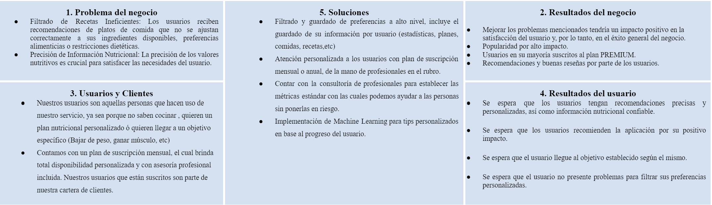
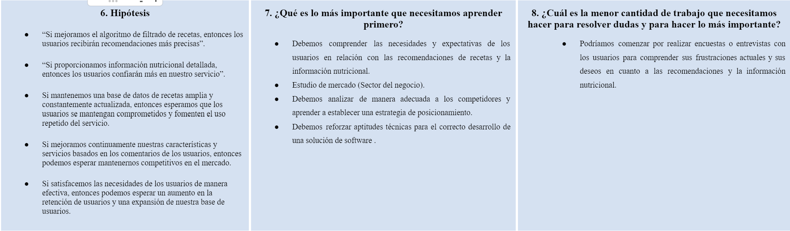

## 1.3. Segmentos objetivo.
Nuestro segmento objetivo está compuesto por 2 tipos de usuarios principalmente:
Cocinero Inexperto:
Para el desarrollo de MealMaster se consideró a cocineros inexpertos que buscan mejorar sus habilidades culinarias y disfrutar de una alimentación más saludable sin la necesidad de experiencia previa en la cocina. Nuestra plataforma brinda una interfaz amigable y muy fácil de usar, donde los cocineros inexpertos  pueden aprender a preparar comidas sencillas y nutritivas, utilizando recetas adaptadas a sus preferencias y disponibilidad de ingredientes. Con tutoriales paso a paso y consejos personalizados, ayudamos a estos cocineros novatos a ganar confianza en la cocina, fomentando un estilo de vida más saludable y autosuficiente.Además, nuestra plataforma presenta un apartado para organizar y diseñar planes alimenticios, los cuales un cocinero inexperto podría aprovechar para cocinar su propio plan.

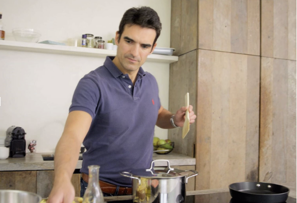


Entusiasta de la Nutrición:
Para los entusiastas de la nutrición que están comprometidos con una alimentación saludable y buscan optimizar su dieta, MealMaster ofrece una solución perfecta. Nuestra plataforma permite a los entusiastas de la nutrición a acceder a recetas nutritivas personalizadas según sus objetivos de salud específicos, preferencias dietéticas y necesidades calóricas. Con información detallada sobre el contenido nutricional de cada plato. MealMaster se convierte en un aliado indispensable para aquellos que desean tomar decisiones informadas sobre su alimentación y mejorar continuamente su bienestar. De igual manera en el apartado de organizar y diseñar plan alimenticio, el entusiasta de la nutrición  puede visualizar el contenido nutricional y su progreso.


# Capítulo II: Requirements Elicitation & Analysis
## 2.1. Competidores.
En el mercado de recetas en línea enfocadas en productos relacionados con la comida saludable, Meal Master se encuentra en un entorno competitivo. A continuación, se presentan los principales competidores directos: 

### 2.1.1. Análisis competitivo.
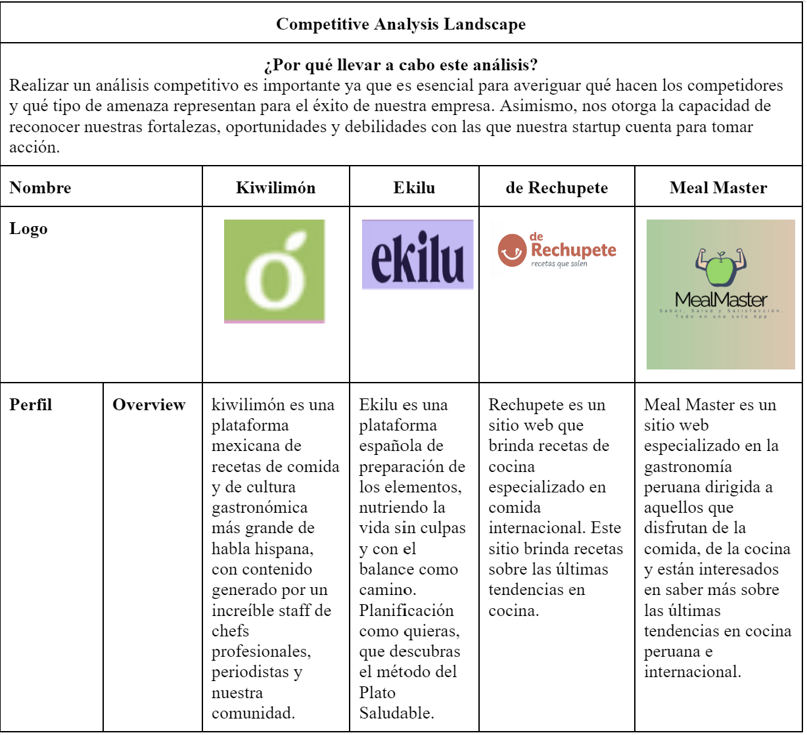
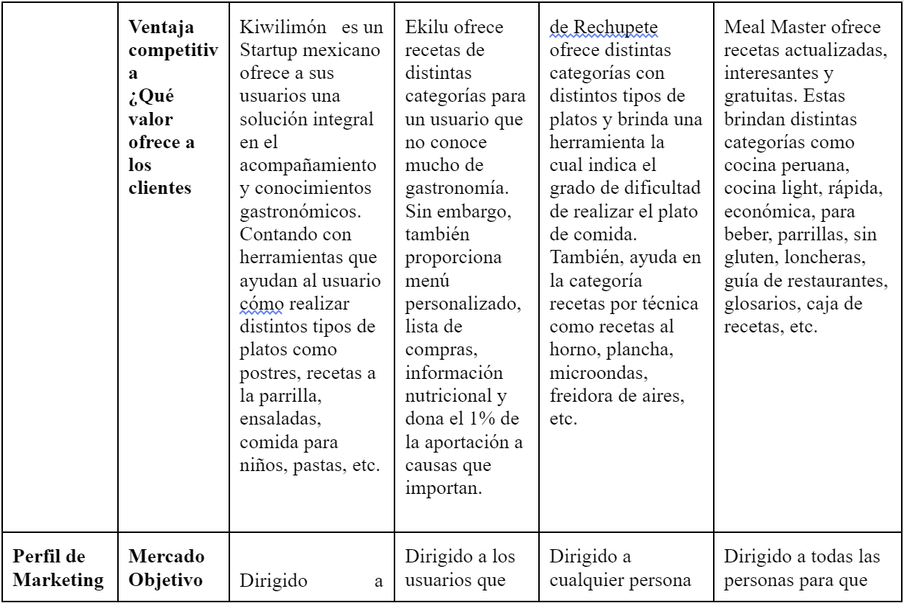
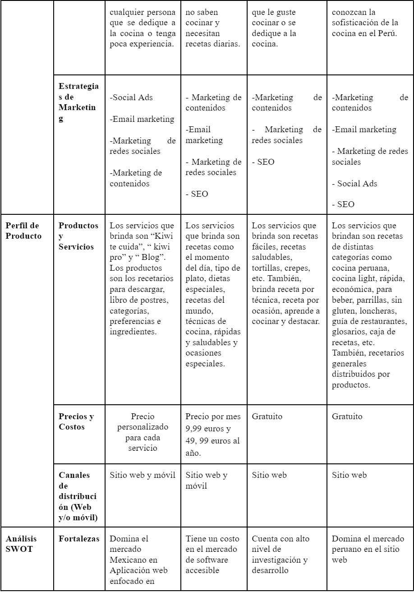
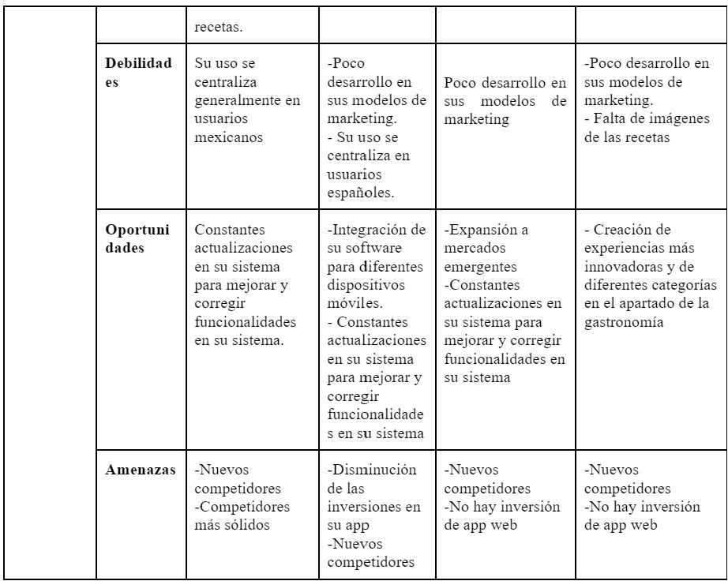
2.1.2. Estrategias y tácticas frente a competidores: 

Liderazgo en costes:
Tenemos la capacidad de producir y ofrecer nuestro producto de manera gratuita, sin agregar limitaciones a sus funciones principales. Asimismo, para las membresías de pago, podemos ofrecer un precio inferior al de nuestros competidores, con la intención de hacer de nuestra aplicación una opción más atractiva. Y también, orientándose a satisfacer las necesidades de nuestros clientes que enfocan su decisión de compra en el precio.
Estrategia de diferenciación:
Tenemos la capacidad de producir y ofrecer nuestro producto de manera gratuita, sin agregar limitaciones a sus funciones principales. Asimismo, para las membresías de pago, podemos ofrecer un precio inferior al de nuestros competidores, con la intención de hacer de nuestra aplicación una opción más atractiva. Y también, orientándose a satisfacer las necesidades de nuestros clientes que enfocan su decisión de compra en el precio.


Estrategia de enfoque:
Somos conscientes que el crecimiento de la tecnología y el incremento en el uso de computadoras y smartphones, han generado una gran demanda en los servicios de gestión y guías gastronómicas. Por ello, nos enfocamos en toda aquella persona que se dedique o quiera dedicarse a la cocina y que requiera un software que le ayude con el correcto uso de sus productos para realizar recetas. 


Táctica de expansión:
A pesar de que la aplicación funciona de manera gratuita. No planeamos saturar de anuncios por cada operación que se realice con ella. Planeamos expandir su uso a través de buenas calificaciones y anuncios.


## 2.2. Entrevistas.
### 2.2.1. Diseño de entrevistas.
**Preguntas generales:**

Preguntas Generales
¿Cuál es su nombre completo?
¿Dónde vive actualmente?
¿Cuál es su fecha de nacimiento?
¿Cuál es su ocupación actual?
¿Tiene experiencia en la cocina? ¿Suele prepararse sus propias comidas?
¿Se encuentra interesado en realizar un seguimiento del valor nutricional de los alimentos que consume?

Preguntas para ambos segmentos
¿Cuáles son los desafíos más comunes que encuentras al planificar tus comidas diarias?
¿Cómo decides qué recetas preparar con los ingredientes que tienes a mano?
¿Qué tipo de información nutricional consideras más importante al elegir una receta?
¿Podrías contarme sobre una experiencia reciente en la que hayas cocinado algo nuevo?
¿Cómo afecta tu rutina diaria la planificación y preparación de tus comidas?
¿Qué te motiva a seguir un plan de alimentación o a cocinar por ti mismo?
¿Qué características valorarías en una aplicación que te ayude a organizar tus comidas?
¿Cómo te gustaría que una aplicación web te asistiera en el seguimiento de tus objetivos nutricionales?
¿Qué te impulsa a buscar nuevas recetas o cambiar tu dieta actual?
¿Cómo evalúas el éxito de tu plan de comidas y nutrición?
Preguntas para el Cocinero Inexperto:
¿Qué tipo de recetas te gustaría ver recomendadas cuando no estás seguro de qué cocinar?
¿Cómo te sientes al probar técnicas de cocina nuevas y cómo te gustaría que una aplicación te guiará en ese proceso?
¿Qué ingredientes sueles tener en tu despensa y cómo decides utilizarlos?
¿Qué factores consideras más intimidantes o desafiantes al momento de cocinar?
Preguntas para la Persona Interesada en el Seguimiento Nutricional:
¿Qué metas específicas tienes en mente al buscar un seguimiento nutricional detallado?
¿Qué herramientas o métodos has utilizado anteriormente para hacer seguimiento de tu dieta y qué te gustaría mejorar?
¿Cómo te mantienes informado sobre nutrición y qué tipo de información buscas regularmente?
¿Qué aspectos de tu salud o bienestar esperas mejorar al tener un mayor control sobre lo que consumes?

### 2.2.2. Registro de entrevistas.
**URL del video completo:** https://drive.google.com/drive/folders/146cf9m54FSZ_IvdMyef8TgF4WLe-uAjj?usp=sharing 
**Cocinero Inexperto**  
  

**Timing: 10:35 min**
**Resumen**
El entrevistado de nombre Daniel, comenta que reside en lima, nació en 2002 y estudia la carrera de Ing. de Sistemas. 
No tiene ningún tipo de experiencia en la cocina. Está muy interesado en aprender y nuestra solución le parece bastante interesante, se considera un amante 
de la tecnología y resalta su gusto por la sazón peruana, por lo que quisiera poder aprender a preparar platillos nacionales. En definitiva sería un usuario de Meal Master.

**Entrevista2**
**URL del video completo:** https://drive.google.com/drive/folders/146cf9m54FSZ_IvdMyef8TgF4WLe-uAjj?usp=sharing 

  
**Timing: 10:46 min**
**Resumen**
El entrevistado de nombre Augusto, reside en Lima, nació en 2005, es estudiante de Ing. de Software.Por lo general no suele cocinar, sin embargo, cuando lo hace, suelen ser cosas muy sencillas. Menciona también la importancia para él, de llevar una buena alimentación. 
Le parece genial la idea de una herramienta digital que le permita no solo aprender a cocinar, sino también elaborar un plan nutricional. Resalta que la complementación 
de las 2 características de la solución, hace que sea mucho mejor y de todas maneras sería un usuario.

**Entrevista3**
**URL del video completo:** https://drive.google.com/drive/folders/146cf9m54FSZ_IvdMyef8TgF4WLe-uAjj?usp=sharing 

  
**Timing: 12:29 min**
**Resumen**

El entrevistado de nombre Fritz, es un joven Piurano de 20 años, estudiante de Derecho. 
La cocina no es su punto fuerte, pese a eso, es capaz de preparar recetas únicamente viendo tutoriales. Le parece muy importante seguir una buena alimentación y que mejor, que poder uno mismo cocinarse. Al mencionarle que en nuestra solución también 
puede llevar un control de su alimentación, le pareció un increíble plus. Indica que si o si será un usuario.

**Entrevista4**
**URL del video completo:**  https://youtu.be/5sxKK-3rASc 

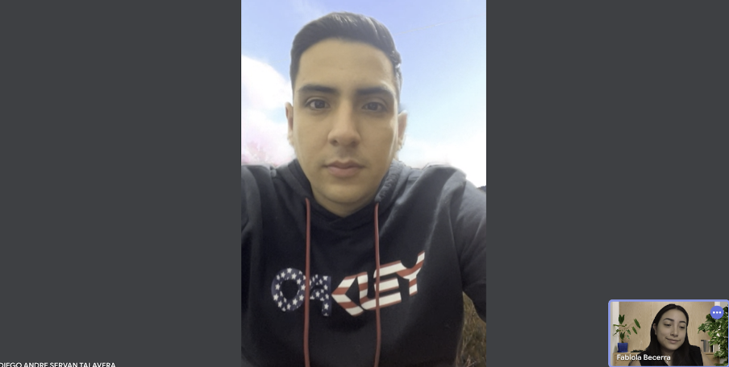  
**Timing: 09:34 min**
**Resumen**
La entrevista fue realizada a Diego Servan. Es ingeniero Industrial, trabaja en el banco . Durante estos años ha logrado combatir con la falta de conocimiento al momento de llevar su comida al trabajo, ya que no conoce muchos platos por cocinar y no tiene muchas ideas de recetas diarias para lograr realizarlo. Sin embargo, Diego se ha ido apoyando de algunas recetas saludables que lograba encontrar en internet , pero no logra realizarlo bien. De hecho, nos comenta que no le gusta cocinar mucho porque no conoce un buen recetario que él pueda realizar.Por último, nos comenta que una aplicación que ayude a conocer distintas recetas le parece una idea excelente y muy interesante.

**Segmento objetivo 2: Entusiasta de la nutrición**

**Entrevista5**
**URL del video completo:**  https://drive.google.com/drive/folders/146cf9m54FSZ_IvdMyef8TgF4WLe-uAjj?usp=sharing 
  
**Timing: 6:44 min**
**Resumen**
El entrevistado de nombre Cesar, reside en Lima, tiene 19 años y estudia Ing de Software. 
Es un amante de la cocina, suele cocinar en su hogar. Sin embargo, Cesar está muy interesado en controlar y llevar un correcto plan alimenticio. Con el cual, logre su objetivo. Lo ideal para él, es algo que sea práctico, sin muchas complicaciones, y con lo cual pueda cumplir su objetivo. Una vez explicado el funcionamiento y determinadas funcionalidades específicas de nuestra solución, Cesar menciona lo entusiasmado que se encuentra por  poder usar una herramienta de este tipo. 

**Entrevista6**
**URL del video completo:**  https://drive.google.com/drive/folders/146cf9m54FSZ_IvdMyef8TgF4WLe-uAjj?usp=sharing 
  
**Timing:  7:39 min**
**Resumen**
El entrevistado de nombre Bruno, reside en Lima , tiene 21 años. 
Menciona que tiene experiencia en la cocina, pero se encuentra muy interesado en mejorar su alimentación en cuanto a calidad y organización de sus alimentos.
Hace ejercicio y parte de su objetivo es hacer un plan nutricional detallado. 
El cual pueda planear sus alimentos para complementarlo con la actividad física que realiza. Hace referencia a que prefiere cocinar en casa, por temas de ahorro, higiene y rapidez.Finalmente, luego de haber expuesto el plan de Meal Master, afirmó que utilizaría y recomendaría nuestra solución. 

**Entrevista7**
**URL del video completo:**  https://youtu.be/Lc20DusLN_c 
  
**Timing:  11:34 min**
**Resumen**
La entrevista fue realizada a Andrea Estrada. Es administradora de empresas desde hace 2 años, trabaja en una empresa de venta de etiquetas evaluando los requerimientos de la empresa en la cual trabaja, brinda prioridad al crecimiento de la empresa.
Durante estos años ha logrado combatir con la falta de conocimiento al momento de llevar su comida al trabajo, ya que no conoce muchos platos por cocinar y no tiene muchas ideas de recetas diarias para lograr realizarlo. Sin embargo, Andrea se ha ido apoyando de algunas recetas saludables que lograba encontrar en internet y le salen deliciosas, pero sin alguna indicación de cómo realizarlo no podría lograrlo. De hecho, nos comenta que no le gusta comer siempre lo mismo, ya que se aburre rápido y siempre le gusta probar cosas nuevas.
Por último, nos comenta que una aplicación que ayude a conocer distintas recetas y que sean saludables le parece una idea excelente y muy interesante, ya que ella cuida mucho su salud y le gustaría saber la cantidad de calorías que consume para lograr su objetivo que es bajar de peso.


### 2.2.3. Análisis de entrevistas.

Segmento 1: Cocinero Inexperto 
Interés Común: Todos desean aprender a cocinar.
Necesidad Clave: Requieren videotutoriales sencillos.
Solución Potencial: Implementar guías paso a paso y videos interactivos.

Sugerencias Específicas:
Introducir una función de tutoriales en video para platillos básicos.
Incluir sugerencias de recetas basadas en ingredientes fáciles de encontrar.
Añadir una función de planificador de comidas que genere listas de compras automáticamente.


Segmento 2: Entusiasta de la Nutrición
Interés Común: Mejorar la nutrición y el control alimenticio.
Necesidad Clave: Herramientas para la gestión y el seguimiento nutricional.
Solución Potencial: Integrar funciones de personalización y seguimiento de dietas.

Sugerencias Concretas:
Implementar un sistema de configuración de objetivos nutricionales con recomendaciones personalizadas.
Desarrollar un contador de calorías y macros para cada receta.
Crear opciones de planificación de menús semanales con listas de compras automatizadas.

## 2.3. Needfinding.
### 2.3.1. User Personas.
2.3.1. User Personas

Para garantizar una comprensión profunda de nuestros segmentos objetivo, hemos llevado a cabo un exhaustivo proceso de elaboración de User Personas. Hemos creado un User Persona para cada uno de los segmentos clave que hemos identificado

**User Persona 1: Cocinero Inexperto**
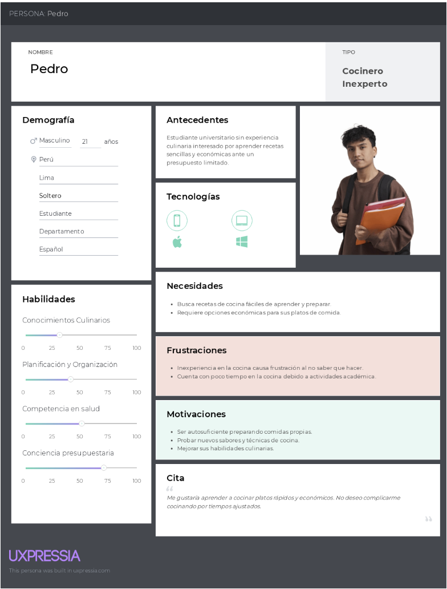
**User Persona 2: Entusiasta de la nutrición**
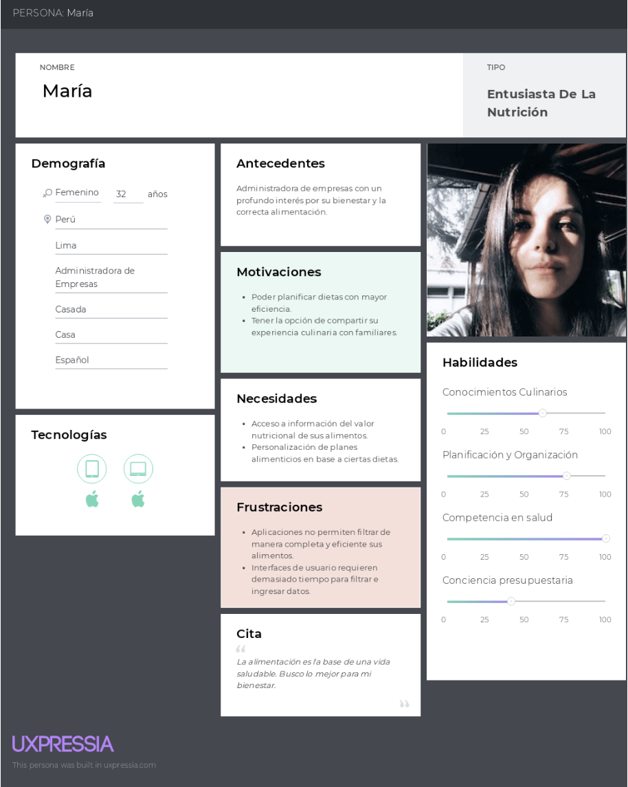


### 2.3.2. User Task Matrix.
En esta sección se presenta el user task matrix, herramienta centrada en los segmentos objetivos, que nos permitirá identificar las tareas y objetivos claves de los usuarios. Además, nos permitirá priorizar características y funcionalidades al momento de realizar el product backlog. Para la frecuencia se han considerado cinco opciones: never, rarely, sometimes, often, always; y para la importancia tres opciones: low, medium, high.

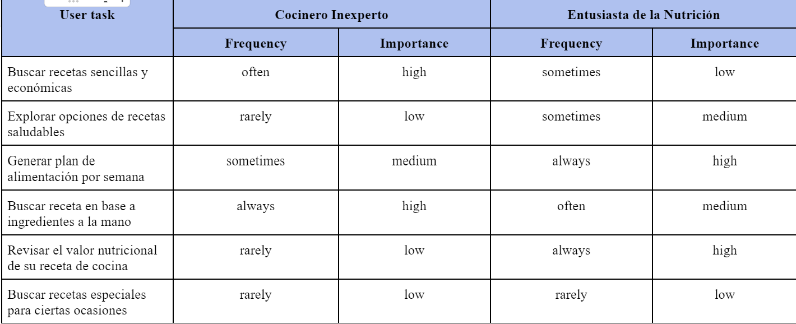

### 2.3.3. User Journey Mapping.
**Registration:**
Why would they trust us?
- s
- s
- s
  
**Onboarding and first use:**
How can they feel successful?
- s
- s
- s  
  
**Sharing:**
Why would they invite others?
- s
- s
- s

### 2.3.4. Empathy Mapping.
En esta sección se presenta el Empathy Mapping, herramienta para crear un perfil detallado de los user persona y desarrollar una comprensión profunda de su perspectiva y experiencia.

**Empathy Mapping 1: Cocinero Inexperto**
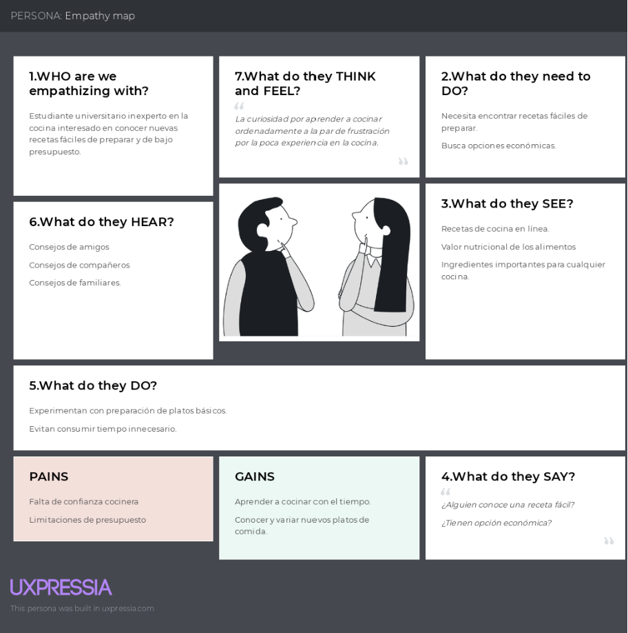

**Empathy Mapping 2: Entusiasta de la nutrición**
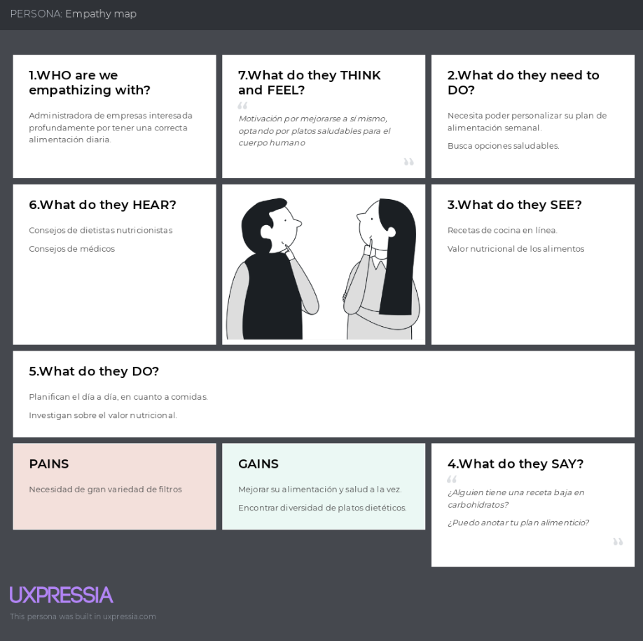


### 2.3.5. As-is Scenario Mapping.

**As-is Scenario Mapping 1: Cocinero Inexperto**  
|-|-|-|-|-|-|
| Fases  | Investigar páginas web de nutrición y para aprender a cocinar |Analizar los planes de cada una de las páginas encontradas | Escoger la página web más confiable|Empezar a estructurar un plan alimenticio en la web| Filtrar mis preferencias alimenticias|
| Doing  | Investigo en internet páginas web de confianza para aprender a cocinar y revisar el valor nutricional de mis platos de comida |Analizar los planes que veo recomendable para lo que busco.|En base a mi previo análisis, escojo la página web más prometedora.|Dentro de la página web, busco realizar la organización de mi plan de alimentos según mis preferencias.|Busco aplicar ciertos filtros para disfrutar del plan alimentario organizado.|
| Thinking  |Espero que existan múltiples plataformas web que ayuden al proceso de cocina. |Ojalá los planes ofrecidos tengan un valor adicional.|Espero haber elegido la página web más confiable de las disponibles.|Espero organizar de forma rápida y efectiva un plan de alimentos.|Espero que el plan alimenticio sea suficientemente efectivo.|
|Feeling|Tengo dudas al momento de investigar y conocer cuál es la opción más conveniente.|Miedo por escoger un plan con información desactualizada.|Siento dudas sobre la seguridad de la página web, pudiendo no ser confiable.|Siento dudas al momento de pensar en los detalles del plan alimenticio por generar, pudiendo ser impráctico.|Me siento aliviado, sabiendo que mis necesidades van a ser saciadas en base a mi correcta elección.|

**To-Be Scenario Mapping 2: Entusiasta de la nutrición**  
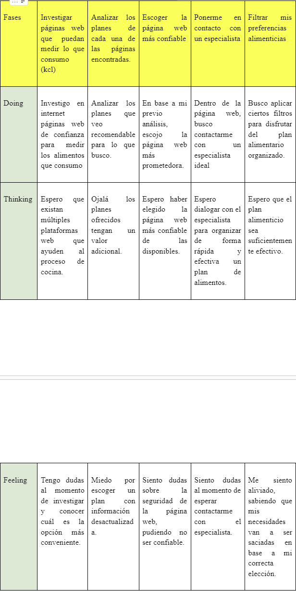


# Capítulo III: Requirements Specification
## 3.1. To-Be Scenario Mapping.

**To-Be Scenario Mapping 1: Cocinero Inexperto**  
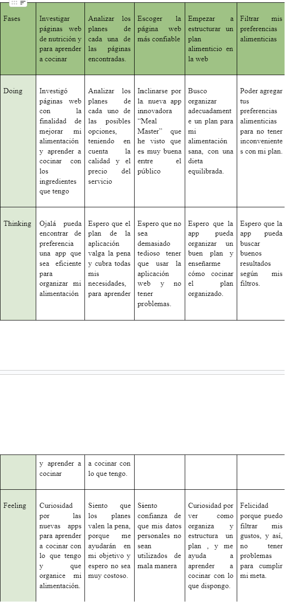

**To-Be Scenario Mapping 2: Clientes que buscan medir las calorías que consumen y llevar un control más detallado, de igual manera con el contacto de un profesional a su disposición.**  
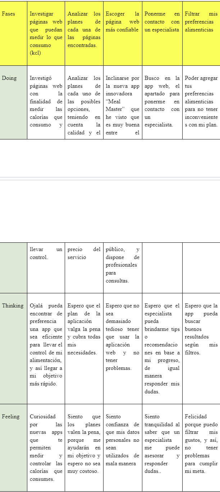

## 3.2. User Stories.

| HU0X | Historia Usuario | "Descripcion"  |
|-|-|-|

## 3.3. Impact Mapping.
**Link del miro:  https://miro.com/app/board/uXjVKNP7IR4=/?share_link_id=521254084234**
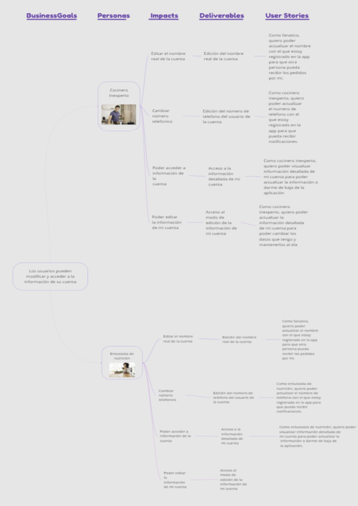

## 3.4. Product Backlog.

| #Orden | User Story ID | Titulo| Descripción| Story Points (1/2/3/5/8) |
| ------ | ------------- | ----- | ---------- | ------------------------ |
| 1      | HU01          | titulo his | desc  | 5                        |

# Capítulo IV: Product Design
## 4.1. Style Guidelines.
### 4.1.1. General Style Guidelines.

#### Branding
Con el propósito de dar estilo y reconocimiento a nuestra aplicación web que posee una variedad de ajustes en los temas de colores, fuentes tipográficas y en el aspecto de diseño estructural, para el desarrollo correcto de nuestro banding hemos tomado en cuenta cada una de las características de nuestra solución .

#### Typography
El tipo de tipografía escogida es Raleway, resalta elegancia y modernidad. Ofreciendo así, una visión amigable y fácil de leer para nuestra plataforma.

#### Logotipo


#### Colors


#### Spacing
El spacing mantiene:
- Botones: padding de 16px vertical y 32px horizontal
- Margin entre texto 16px
- Margin entre elementos 24px
- Margin entre secciones 72px

#### Dimension
La dimensión para adoptar en cuanto al diseño es un tono formal y entusiasta, aplicando colores profesionales como el verde presentado y un tono entusiasta con colores celeste y beige. Asimismo, para el diseño de los íconos y formas adoptaremos diseños amigables al usuario utilizando bordes curvos en su mayoría.

### 4.1.2. Web Style Guidelines.
En el presente apartado, enseñaremos las decisiones que fueron tomadas en base a los estándares visuales y los distintos tipos de interacción con respecto al responsive web interface.


## 4.2. Information Architecture.
En esta sección profundizaremos y sustentamos las decisiones de diseño que escogimos como equipo durante el desarrollo del proyecto. Nuestro objetivo es facilitar al usuario adaptarse a nuestra aplicación, brevemente explicaremos las propuestas claves para el diseño de nuestra Landing Page y las aplicaciones.
### 4.2.1. Organization Systems.
#### Visual:

En este campo, nos organizamos de manera jerárquica. Este modelo incluye el diseño de características visuales que facilitan la comprensión del usuario. Los elementos más grandes de nuestra página web se encuentran en la jerarquía de primer orden o máximo nivel. Estos incluyen los elementos principales que captarán la atención de nuestros usuarios empleados y empleadores al ingresar a la web, como los logotipos, los títulos, las tarjetas botones, entre otros. Los componentes que están directamente relacionados con los subtítulos de descripción y los cuadros de ingreso de información se encuentran en el segundo nivel. Finalmente, el tercer y último nivel corresponde a los componentes complementarios, como el icono de búsqueda, la foto de perfil, entre otros.


#### Por contenido:


- **Alfabético**: se distribuyen alfabéticamente los nombres de platos de comida en los que esté actualmente en la aplicación.
- **Cronológico**: se distribuyen las nuevas recetas por la fecha más reciente.
- **Según prioridad**: se muestran perfiles recomendados según los especialistas que requiera un tipo de dieta en específico o tips personalizados. 

### 4.2.2. Labeling Systems.
- **Encabezados (headings):** Estas etiquetas benefician al usuario para poder comprender toda la información de un apartado en el que se encuentre con tan solo leerla.
- **Etiquetas textuales:** Son etiquetas que se usan comúnmente para indicar ciertos apartados.
- **Etiquetas icónicas (conics labels):** Consiste en utilizar imágenes para que esta etiqueta pueda tener significado pleno sin necesidad de texto adicional, pero normalmente, van acompañadas de etiquetas textuales para que el usuario no se confunda

Estas dos etiquetas en cuestión se evidencian en la barra de navegación de nuestro mockup.

### 4.2.3. SEO Tags and Meta Tags

Las metas etiquetas nos brindan apoyo en  indicar información codificada y especificar los metadatos. Estas no son visualizadas en los sitios web, estos son leídos por los navegadores o rastreadores web. Estas metas etiquetas facilitan el análisis de archivos HTML y facilita el mantenimiento del contenido del archivo. Además, estas etiquetas nos ayudan en el posicionamiento de nuestra página web en los buscadores para así obtener buenos resultados de búsquedas.

#### Meta Description Tag:
- **Título**   
Esta etiqueta es una de las más importantes y por lo general se pone antes que cualquier otra meta etiqueta. Esta etiqueta es utilizada o leída por todos los motores de búsqueda como encabezado en las páginas de resultados de los motores de búsqueda (SERP).

`<title> Mejora tu salud con Meal Master</title>`
 
- **Codificación de caracteres**   
Esta etiqueta ayudará a que muestre correctamente los caracteres especiales en la página. 

`<meta charset="utf-8"/>`
- **Descripción**  
Esta meta etiqueta nos sirve para proporcionar un resumen del contenido de la página web. Aquí debemos dar una breve información de lo que se puede visualizar en la página.

`<meta name="description" content="Índice de dietas. El índice de dietas ayuda a que el usuario pueda ver.... "/>`

- **Palabras clave**   
En esta etiqueta se pone las palabras claves relacionadas con el tema o contenido de la página web.

`<meta name="keywords" content="dietas, dietas saludables, comidas diarias, comida sana"/>`


### 4.2.4. Searching Systems.
Hemos implementado los sistemas de búsqueda en el apartado de búsqueda de platos de comida.  Aquí el usuario escribirá y buscará dentro de una caja de texto el tipo de plato que desea cocinar. Entonces se desplegará una overlay hacia abajo mostrando las recomendaciones de tipo de dietas o platos de comida que quizá esté buscando o sea de su interés.

### 4.2.5. Navigation Systems.
	
**Landing Page:**   
El usuario podrá direccionarse a otra frame por medio de realizar un click en los linklabel, cada uno con una dirección relacionada al contenido del label, que se encontraran en los encabezados o headers. Para mostrar nuestros diseños, usaremos un encabezado. Los llevará a las secciones con sus temas correspondientes al hacer clic en "Características" o "Testimonios". Asimismo, se implementarán botones para facilitar la búsqueda del usuario si se quedó interesado en algún bloque de la página principal.

**Aplicación Web:**  
Para la aplicación web haremos uso de un sidebar para la navegación entre los distintos apartados disponibles en ella. También haremos uso de secciones con “Accesos directos” desde la sección inicial o “Home” de la Aplicación web.

## 4.3. Landing Page UI Design
### 4.3.2. Landing Page Wireframe
 Link Figma Landing Page Wireframe: https://www.figma.com/proto/nEypHPwCcG8EhmtVhJOvJr/MealMaster?page-id=0%3A1&type=design&node-id=167-834&viewport=4399%2C734%2C0.39&t=Ho8sRzWynTSVflcb-1&scaling=min-zoom&starting-point-node-id=167%3A834&show-proto-sidebar=1&mode=design 


### 4.3.2. Landing Page Mock-up
 Link Figma Landing Page Mock-Up: https://www.figma.com/proto/nEypHPwCcG8EhmtVhJOvJr/MealMaster?page-id=0%3A1&type=design&node-id=54-332&viewport=4399%2C734%2C0.39&t=otNJnnSFIW0hXd45-1&scaling=min-zoom&starting-point-node-id=54%3A332&show-proto-sidebar=1&mode=design 


## 4.4. Web Applications UX/UI Design.
### 4.4.1. Web Applications Wireframes.
En primer lugar, se presentarán los wireframes de la aplicación, que luego serán usados como plantilla.


### 4.4.2. Web Applications Wireflow Diagrams.
En esta sección, se presentan los wireflows de la aplicación, guiándose de las historias de usuario respectivas.

User Goal: El usuario se registra, recupera su contraseña o inicia sesión


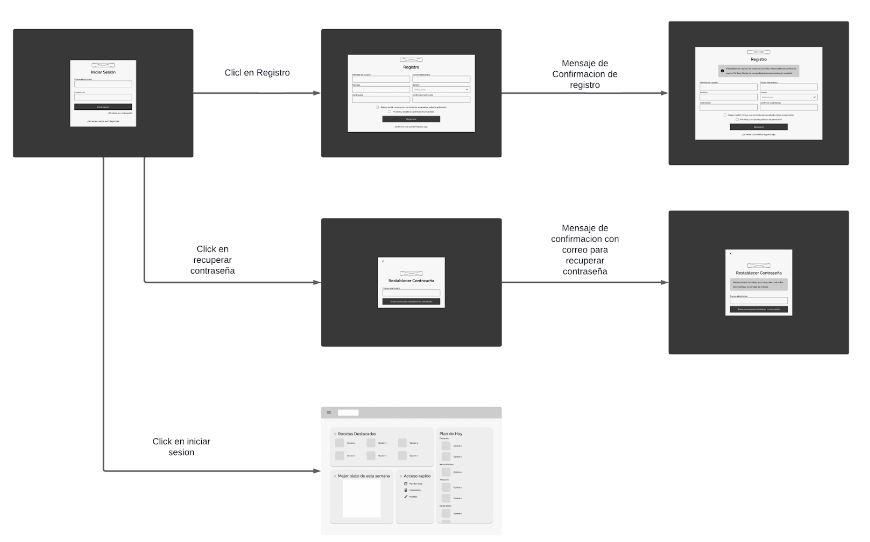

Descripción:
Al ingresar a la aplicación el usuario se encuentra con un formulario para inicio de sesión. Además, tiene también la opción de registrarse en caso no posea una cuenta y la opción de cambiar su contraseña en caso de que la haya olvidado. Dentro del formulario de registro podrá llenar todos sus datos y el mismo formulario le confirmará que su registro fue exitoso. Cuando el usuario ingrese correctamente sus credenciales podrá ingresar a su página de inicio.
User Goal: Perfil de usuario
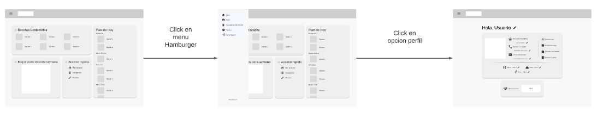

Descripción:
Si el usuario desea acceder a su perfil. Desde la página de inicio puede hacer click en el menú “Hamburger” ubicado en la esquina superior izquierda, lo que desplegará un “Sidebar” donde se mostrarán todas las opciones disponibles, entre ellas el “Perfil”. Haciendo click en la opción “Perfil” el usuario podrá acceder a su perfil y visualizar toda su información.


### 4.4.3. Web Applications Mock-Ups

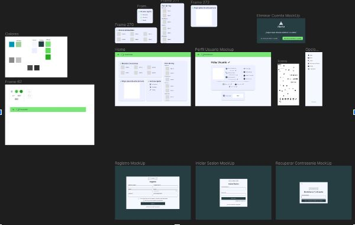

link: https://www.figma.com/proto/nEypHPwCcG8EhmtVhJOvJr/MealMaster?page-id=0%3A1&type=design&node-id=52-1044&viewport=2279%2C660%2C0.24&t=d8bNesaa3lxnFw7a-1&scaling=min-zoom&starting-point-node-id=52%3A1044&show-proto-sidebar=1&mode=design 

### 4.4.4. Web Applications User Flow Diagrams
Para esta sección, se presentan los user flow diagrams, los cuales son diagramas que ayudan a presenciar de mejor manera el flujo por el cual pasará el usuario al momento de realizar cierta acción.

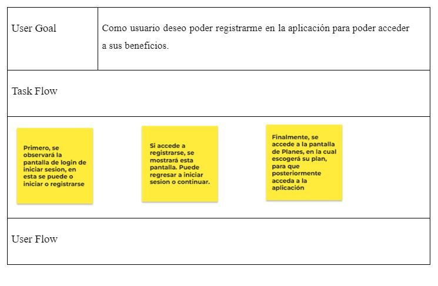
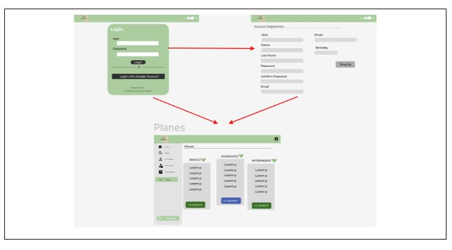
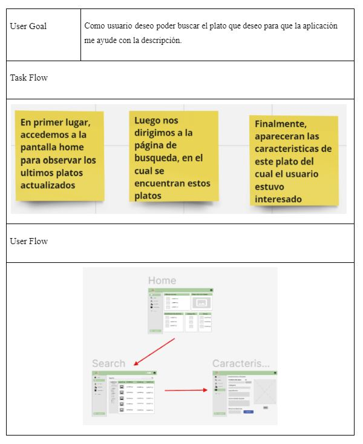


## 4.5. Web Applications Prototyping.

En esta sección se compartirán los prototipos relacionados a la aplicación web, donde se presentan el alcance de los user goals en ambos segmentos objetivos. 

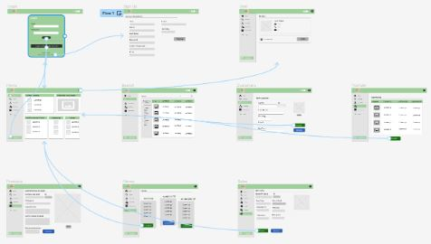

link: https://www.figma.com/proto/CdgFvnlG3KaH8i1DkzBdPS/Landing-Page-Mock-up?page-id=0%3A1&type=design&node-id=44-1166&viewport=-625%2C-929%2C0.16&t=eDwh3NJDNQ9cpKtd-1&scaling=contain&starting-point-node-id=44%3A1166&mode=design 

## 4.6. Domain-Driven Software Architecture.
### 4.6.1. Software Architecture Context Diagram.
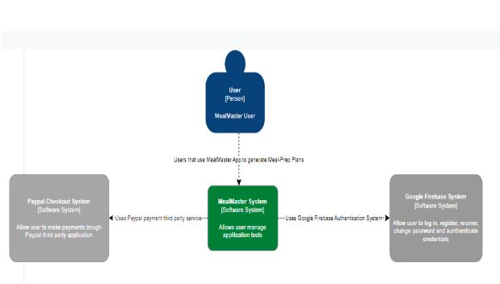
1. System Context Diagram: Diagrama que muestra la relacion del aplicativo con los usuarios
se incluyen servicios externos.
   
### 4.6.2. Software Architecture Container Diagrams.
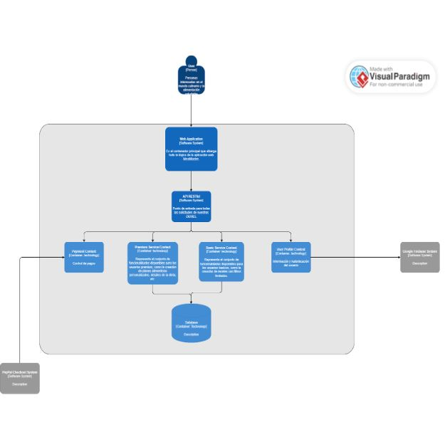

 Container Diagrams. Sirve para entender cómo funciona y el proceso, Se especifican DB's, indexers, Search engine, las Apis que usen los bounded context y se conectan por flechas, las cuales tienen como objetivo explicar la dirección y relación junto a que se está enviando/comunicando (TCP) 
 
### 4.6.3. Software Architecture Components Diagrams.
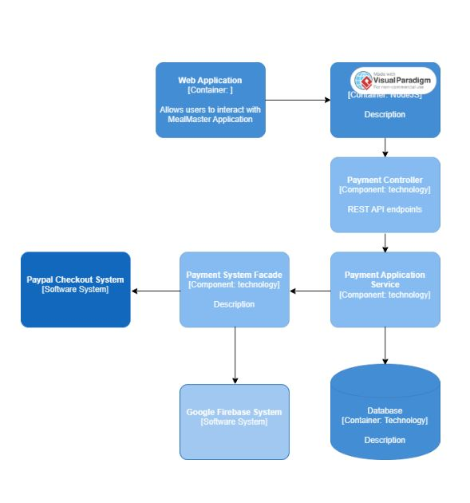

Component diagrams: Estos van a mostrar las ordenes, procesos, mensajes y componentes utilizados en el uso del aplicativo, claro se deben hacer diferentes de estos para cada bounded o USER GOALS
## 4.7. Software Object-Oriented Design.
### 4.7.1. Class Diagrams.
Link:  https://lucid.app/lucidchart/16233ba4-2e87-4655-b479-e883196ddf2a/edit?viewport_loc=-3294%2C-1036%2C7700%2C3775%2C0_0&invitationId=inv_331dbcfa-612c-48d8-8356-f7308a4a82d6
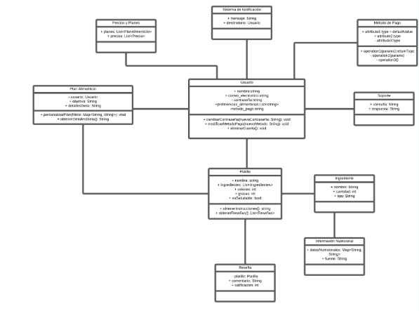

### 4.7.2. Class Dictionary.


## 4.8. Database Design.
### 4.8.1. Database Diagram.


# Capítulo V: Product Implementation, Validation & Deployment
## 5.1. Software Configuration Management.
### 5.1.1. Software Development Environment Configuration.
Especificaciones de donde vamos a hacer el proyecto (vscode supongo)
extensiones tmbn? nose bn q quieren aca
### 5.1.2. Source Code Management.
El gitjab donde tengamos el proyecto
### 5.1.3. Source Code Style Guide & Conventions.
Que usamos con css (en caso usemos software para SASS)
supongo q tmbn cositas de como hacemo el code capas algun tipo de codigo para comunicarse entre comments
### 5.1.4. Software Deployment Configuration.
Configuraciones de donde y como deployeamos el proyecto
## 5.2. Landing Page, Services & Applications Implementation.
### 5.2.X. Sprint 1
#### 5.2.X.1. Sprint Planning 1.
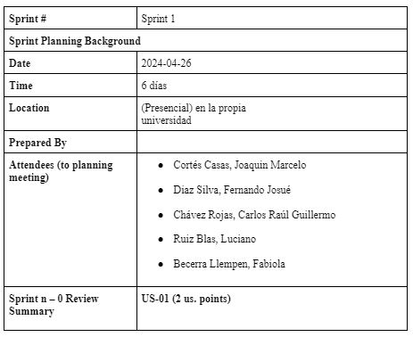
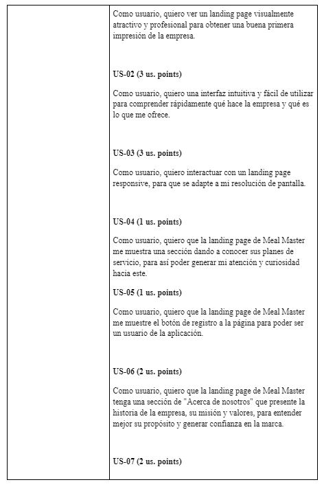
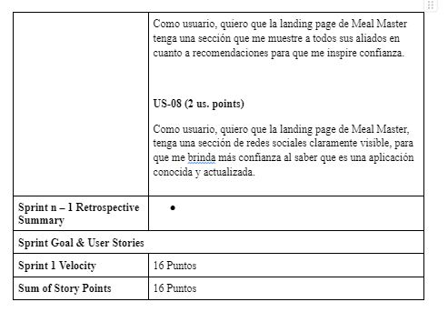

#### 5.2.X.2. Sprint Backlog n.
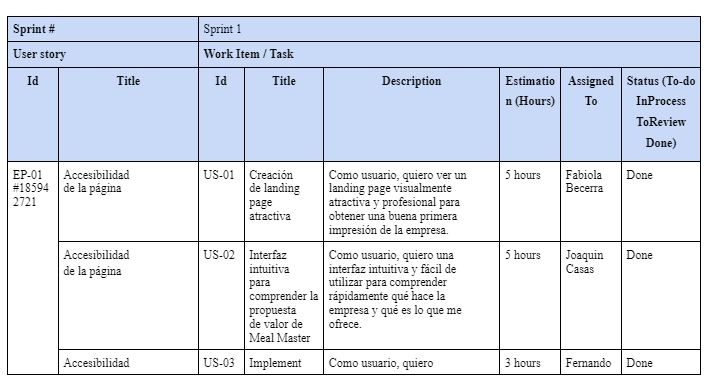
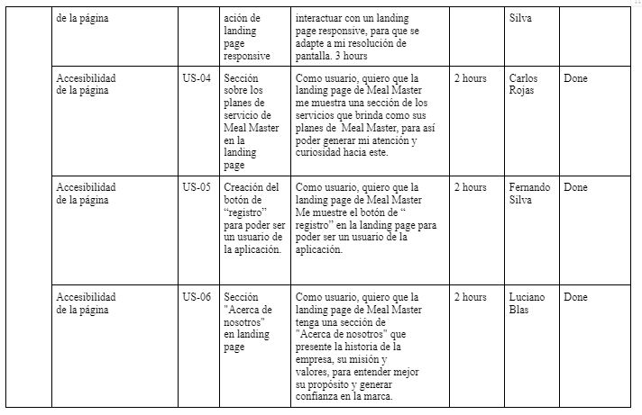
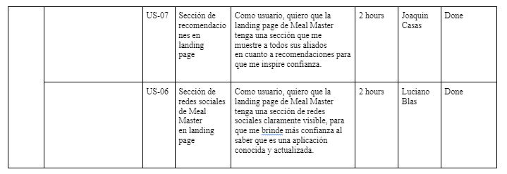

#### 5.2.X.3. Development Evidence for Sprint Review.

#### 5.2.X.4. Testing Suite Evidence for Sprint Review.

#### 5.2.X.5. Execution Evidence for Sprint Review.

#### 5.2.X.6. Services Documentation Evidence for Sprint Review.

#### 5.2.X.7. Software Deployment Evidence for Sprint Review.

#### 5.2.X.8. Team Collaboration Insights during Sprint.
 imagenes de colaboraciones github

## 5.3. Validation Interviews.
### 5.3.1. Diseño de Entrevistas.
**Preguntas generales:**

1. ¿Cuál es su nombre? 
2. ¿Qué edad tiene? 
3. ¿A qué se dedica? 
4. ¿[Opinion de idea de propuesta]? 

**Entrevistas usuario segmento 2**
1. ¿Lorem?
2. ¿Lorem?
3. ¿Lorem?
4. ¿Lorem?  
   
**Entrevistas usuario segmento 2**
1. ¿Lorem? 
2. ¿Lorem?
3. ¿Lorem?
4. ¿Lorem? 
### 5.3.2. Registro de Entrevistas.
**Segmento 1**  
Nombre: _____
Edad: _ años 
Ocupación: _____  
  
{texto mucho}

**Segmento 2**  
Nombre: _____
Edad: _ años 
Ocupación: _____  

{texto}
### 5.3.3. Evaluaciones según heurísticas.
| HEURÍSTICA   | EVALUACIÓN ✅❌ | NOTA      |
| --------------------------------------------- | ---------- | --------- |
| Visibilidad del estado del sistema            |            | {texto}   |
| Coincidencia entre el sistema y el mundo real |            | {texto}   |
| Control y libertad del usuario                |            | {texto}   |
| Consistencia y estándares                     |            | {texto}   |
| Prevención de errores                         |            | {texto}   |
| Mostrar antes que recordar                    |            | {texto}   |
| Flexibilidad y eficiencia de uso              |            | {texto}   |
| Diseño estético y minimalista                 |            | {texto}   |
| Comunicar errores con facilidad               |            | {texto}   |
| Ayuda y documentación                         |            | {texto}   |
## 5.4. Video About-the-Product.
[URL del video about the product](https://www.example.com)
# Conclusiones
{texto}
# Conclusiones y recomendaciones.
{texto}
# Video About-the-Team.
[URL del video about the team](https://www.example.com)

# Bibliografía
qoomon. (2021, 11 enero). Conventional Commit Messages. Gist.
Recuperado 20 de junio de 2022, de [LINK](https://gist.github.com/qoomon/5dfcdf8eec66a051ecd85625518cfd13)

LeaseIN. (2018). Importancia de contar con un equipo de soporte
técnico. [Entrada en blog]. Recuperado de:
[LINK](https://leasein.pe/blog/branding-empresarial-importanciasoporte-tecnico/)
``` 
formato

"Apellido", Ini.Ciales. & "otroAutor", O.A. (año). titulo del articulo.
        "nombre del articulo o lo q sea, Volumen(si es que tiene), numero  de pagina"#-#. https//link.org/eeeseneko

```
# Anexos

datos, gráficos, imágenes, esquemas, mapas o referencias de otros autores


